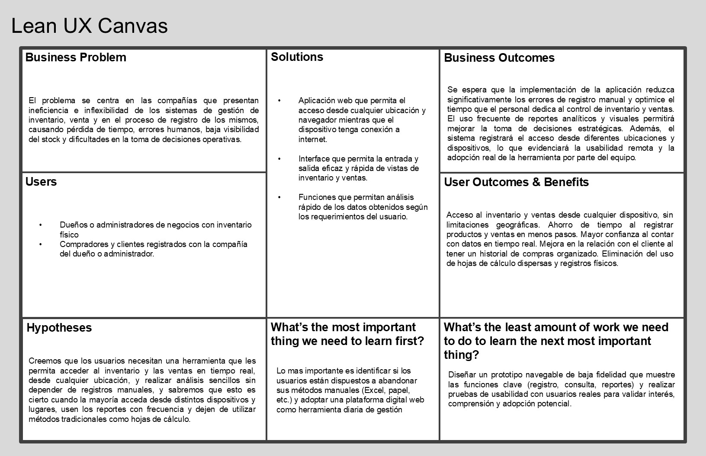

<!--* caratula -->

<div align="center">

# ✨ Informe Trabajo Final ✨


### Universidad Peruana de Ciencias Aplicadas 🎓

🧑‍💻 Ingeniería de software - 2025-01

**Sección:** 4364

**Docente:** Alex Humberto Sánchez Ponce

**StartUp:** StockHunters 📦

**Producto:** Lubrimax

<div align='left'>	

~~~C#
string[] Integrantes() {
    return new string[] {
        "🧑‍💻 Yum Gonzales, Jorge Suin - U202210838",
        "👩‍💻 Miranda Ayasta, Rogger Faryd - U202319239",
        "👩‍💻 Apellidos, Nombres - Codigo",
        "👩‍💻 Apellidos, Nombres - Codigo",
        "👩‍💻 Apellidos, Nombres - Codigo"
    };
}
~~~

</div>

Abril del 2025 🗓️

</div>

<!--* informacion sobre el proyecto -->

## Registro de versiones del Informe

## Project Report Collaboration Insights

<div>

## Contenido

- [✨ Informe Trabajo Final ✨](#-informe-trabajo-final-)
    - [Universidad Peruana de Ciencias Aplicadas 🎓](#universidad-peruana-de-ciencias-aplicadas-)
  - [Registro de versiones del Informe](#registro-de-versiones-del-informe)
  - [Project Report Collaboration Insights](#project-report-collaboration-insights)
  - [Contenido](#contenido)
  - [Student Outcome](#student-outcome)
- [Capítulo I: Introducción](#capítulo-i-introducción)
  - [1.1. Startup Profile](#11-startup-profile)
    - [1.1.1. Descripción de la Startup](#111-descripción-de-la-startup)
    - [1.1.2 Perfiles de integrantes del equipo](#112-perfiles-de-integrantes-del-equipo)
  - [1.2. Solution Profile](#12-solution-profile)
    - [1.2.1 Antecedentes y problemática](#121-antecedentes-y-problemática)
      - [⁉️5“W”s + 2"H"'s](#️5ws--2hs)
        - [🟡 WHAT (QUÉ)](#-what-qué)
        - [🟡 WHEN (CUANDO)](#-when-cuando)
        - [🟡 WHERE (DONDE)](#-where-donde)
        - [🟡 WHO (QUIEN)](#-who-quien)
        - [🟡 WHY (POR QUE)](#-why-por-que)
        - [🟡 HOW (COMO)](#-how-como)
        - [🟡 HOW MUCH (CUANTO)](#-how-much-cuanto)
    - [1.2.2 Lean Ux Process](#122-lean-ux-process)
      - [1.2.2.1. Lean UX Problem Statements](#1221-lean-ux-problem-statements)
      - [1.2.2.2. Lean UX Assumptions](#1222-lean-ux-assumptions)
        - [Business Outcomes:](#business-outcomes)
        - [User Outcomes](#user-outcomes)
      - [1.2.2.3. Lean UX Hypothesis Statements](#1223-lean-ux-hypothesis-statements)
      - [1.2.2.4. Lean UX Canvas](#1224-lean-ux-canvas)
  - [Segmentos Objetivos](#segmentos-objetivos)
- [Capítulo II: Requeriments Elicitation \& Analysis](#capítulo-ii-requeriments-elicitation--analysis)
  - [2.1. Competidores](#21-competidores)
    - [2.1.1. Análisis competitivo](#211-análisis-competitivo)
    - [2.1.2. Estrategias y tácticas frente a competidores](#212-estrategias-y-tácticas-frente-a-competidores)
  - [2.2. Entrevistas 📝](#22-entrevistas-)
    - [2.2.1. Diseño de entrevistas](#221-diseño-de-entrevistas)
    - [2.2.2. Registro de entrevistas](#222-registro-de-entrevistas)
    - [2.2.3. Análisis de entrevistas](#223-análisis-de-entrevistas)
  - [2.3. Needfinding](#23-needfinding)
    - [2.3.1. User Personas](#231-user-personas)
    - [2.3.2. User Task Matrix](#232-user-task-matrix)
    - [2.3.3. User Journey Mapping](#233-user-journey-mapping)
    - [2.3.4. Empathy Mapping](#234-empathy-mapping)
    - [2.3.5. As-is Scenario Mapping](#235-as-is-scenario-mapping)
  - [2.4. Ubiquitous Language](#24-ubiquitous-language)
- [Capítulo III: Requeriments Specification](#capítulo-iii-requeriments-specification)
  - [3.1. To-Be Scenario Mapping](#31-to-be-scenario-mapping)
  - [3.2. User Stories](#32-user-stories)
  - [3.3. Impact Mapping](#33-impact-mapping)
  - [3.4. Product Backlog](#34-product-backlog)
- [Capítulo IV: Product Desing](#capítulo-iv-product-desing)
  - [4.1. Style Guidelines](#41-style-guidelines)
    - [4.1.1. General Style Guidelines](#411-general-style-guidelines)
    - [4.1.2. Web Style Guidelines](#412-web-style-guidelines)
  - [4.2. Information Architecture](#42-information-architecture)
    - [4.2.1. Organization Systems](#421-organization-systems)
    - [4.2.2. Labeling Systems](#422-labeling-systems)
    - [4.2.3. SEO Tags and Meta Tags](#423-seo-tags-and-meta-tags)
    - [4.2.4. Searching Systems](#424-searching-systems)
    - [4.2.5. Navigation Systems](#425-navigation-systems)
  - [4.3. Landing Page UI Desing](#43-landing-page-ui-desing)
    - [4.3.1. Landing Page Wireframes](#431-landing-page-wireframes)
    - [4.3.2. Landing Page Mock-Up](#432-landing-page-mock-up)
  - [4.4. Web Applications UX/UI Desing](#44-web-applications-uxui-desing)
    - [4.4.1. Web Applications Wireframes](#441-web-applications-wireframes)
    - [4.4.2. Web Applications Wireflow Diagrams](#442-web-applications-wireflow-diagrams)
    - [4.4.3. Web Applications User Flow Diagrams](#443-web-applications-user-flow-diagrams)
  - [4.5. Web Applications Prototyping](#45-web-applications-prototyping)
  - [4.6. Domain-Driven Software Architecture](#46-domain-driven-software-architecture)
    - [4.6.1. Software Architecture Context Diagram](#461-software-architecture-context-diagram)
    - [4.6.2. Software Architecture Container Diagram](#462-software-architecture-container-diagram)
    - [4.6.3. Software Architecture Components Diagram](#463-software-architecture-components-diagram)
  - [4.7. Software Object-Oriented Desing](#47-software-object-oriented-desing)
    - [4.7.1. Class Diagram](#471-class-diagram)
    - [4.7.2. Class Dictionary](#472-class-dictionary)
  - [4.8. Database Desing](#48-database-desing)
    - [4.8.1. Database Diagram](#481-database-diagram)
- [Capítulo V: Product Implementation, Validation \& Deployment](#capítulo-v-product-implementation-validation--deployment)
  - [5.1. Software Configuration Management](#51-software-configuration-management)
    - [5.1.1. Software Development Environment Configuration](#511-software-development-environment-configuration)
    - [5.1.2. Source Code Management](#512-source-code-management)
    - [5.1.3. Source Code Style Guide \& Conventions](#513-source-code-style-guide--conventions)
    - [5.1.4. Software Deployment Configuration](#514-software-deployment-configuration)
  - [5.2. Landing Page, Service \& Applications Implementation](#52-landing-page-service--applications-implementation)
    - [5.2.x. Sprints](#52x-sprints)
  - [5.3. Validation Interviews](#53-validation-interviews)
    - [5.3.1. Diseño de Entrevistas](#531-diseño-de-entrevistas)
    - [5.3.2. Registro de Entrevistas](#532-registro-de-entrevistas)
    - [5.3.3. Evaluaciones según heurísticas](#533-evaluaciones-según-heurísticas)
  - [5.4. Video About-the-Product](#54-video-about-the-product)
- [Conclusiones](#conclusiones)
  - [Conclusiones y recomendaciones](#conclusiones-y-recomendaciones)
  - [Video About-the-Team](#video-about-the-team)


## Student Outcome

</div>


<!--* contenido -->

# Capítulo I: Introducción

## 1.1. Startup Profile


### 1.1.1. Descripción de la Startup
  
 En lubrimax, nos encargamos de ofrecer un servicio de gestión de inventario y ventas para empresas con inventario físico que buscan optimizar su operación y mejorar la atención al cliente. Nuestra plataforma permite a los usuarios registrar entradas y salidas de productos, gestionar ventas, generar reportes estadísticos y atender. Buscamos abordar los desafios de las companias y sus necesidades para un servicio customisado.

 **Mision:** Brindar a los negocios con inventario físico una herramienta digital simple, accesible y poderosa que transforme la manera en que gestionan su stock, ventas y atención al cliente, ayudándolos a crecer con tecnología fácil de usar y adaptada a sus necesidades reales.

 **Vision:** Ser la solución digital líder en Latinoamérica para la gestión de inventario inteligente en negocios físicos, ofreciendo innovación continua, automatización accesible y una experiencia centrada en el usuario que impulse la transformación digital de miles de emprendedores y comercios.

### 1.1.2 Perfiles de integrantes del equipo

   <!--TODO: integrante 1 -->

**> 🧑‍💻 Jorge Suin Yum Gonzales**
   <div align='center'>

   

   ~~~txt
   🎓 Soy estudiante de la Universidad Peruana de Ciencias Aplicadas (UPC), 
   actualmente curso la carrera de Ingeniería de Software.
   
   💻 Tengo experiencia en lenguajes como C++ y Python, así como en el uso 
   de Git y la estructura de trabajo basada en Gitflow 🔁.
   
   🤝 Poseo habilidades que me permiten trabajar en equipo de forma puntual, 
   responsable y con iniciativa para participar activamente en el desarrollo 
   de aplicaciones y sus requerimientos 📱⚙️.
   ~~~

   </div>

   <!--TODO: integrante 2 -->

**> 🧑‍💻 Rogger Faryd Miranda Ayasta**
   <div align='center'>

   

   ~~~txt
   🎓 Soy estudiante de Ingeniería de Software, 
   actualmente curso el 5.º ciclo de la carrera.

   💻 A lo largo de mi formación he aprendido diversos lenguajes de programación, como:
   ➡️ C++
   ➡️ Python
   ➡️ JavaScript
   ➡️ HTML & CSS

   🤝 Me destaco por mi responsabilidad, mis habilidades 
   para el trabajo en equipo y mi motivación constante por 
   seguir aprendiendo 📚.
   ~~~

   </div>


   <!--TODO: integrante 3 -->

**> 🧑‍💻 Integrante 3**
   <div align='center'>

   

   ~~~txt
   Descripción
   ~~~

   </div>


   <!--TODO: integrante 4 -->

**> 🧑‍💻 Integrante 4**
   <div align='center'>

   

   ~~~txt
   Descripción
   ~~~

   </div>


   <!--TODO: integrante 5 -->

**> 🧑‍💻 Integrante 5**
   <div align='center'>

   

   ~~~txt
   Descripción
   ~~~

   </div>

## 1.2. Solution Profile

### 1.2.1 Antecedentes y problemática
  En el presente la gran mayoría de companias que ofrecen productos, requieren de un sistema de inventario y venta para
  gestionar y visualizar las estadísticas necesarias para futuras decisiones. Sin embargo, esto puede econtrarse
  desafiante e impractico debido a las formas limitadas de acceso, gestion y registro que son causados metodos
  ineficientes de registro y almacenamiento de esta información. Esto causa retrasos, incomodidades y perdidas de tiempo
  del dueño y el cliente interesesada en esta información.

#### ⁉️5“W”s + 2"H"'s

##### 🟡 WHAT (QUÉ)

- **¿Cual es el problema?**

  El problema se refiere al método ineficiente de registrar inventario y ventas lo que causan formas impracticas de
  acceder la información, como ir al mismo almacén solo para saber cuanto de un producto hay o la cantidad de ventas en
  un Mes. Este registro manual e inflexible también impide un facil análisis de las ventas y las estadísticas que
  potencialmente podrian mejorar las deicisiones futuras. Finalmente este tipo de registro causa que la base de datos o
  el medio en que se esté guardando la información tenga que ser copiado o movido para trabajar en ello lo cual puede
  causar errores de asincronización o falta de datos causados por error humano.
  <br>

##### 🟡 WHEN (CUANDO)

- **¿Cuando sucede el problema?**

  El problema ocurre cada vez que el dueño quiere acceder al inventario y a la información de venta desde el exterior al
  inventario. Esto problema puede presentarse de las siguentes maneras: al querer visualizar el inventario desde
  cualquier dispositivo o lugar, al querer analizar rapidamente las estadisticas y al querer saber informacion de
  clientes y fechas de manera rápida.
  <br>

- **¿Cuando utiliza el cliente el producto?**

  El cliente (usuario del sistema) lo utiliza diariamente para registrar nuevas ventas, actualizar el inventario,
  acceder a reportes estadísticos y consultar información desde cualquier lugar y en cualquier momento, lo cual mejora
  la productividad y la capacidad de respuesta del negocio.
  <br>

##### 🟡 WHERE (DONDE)

- **¿Dónde se presenta el problema?**
  En negocios que no cuentan con un sistema centralizado accesible desde múltiples plataformas, y que dependen de
  registros físicos, hojas de cálculo o software local para controlar el inventario y las ventas.
  <br>

- **¿Dónde se usa el producto?**
  La aplicación web se utiliza desde cualquier dispositivo con acceso a internet (PC, laptop, tablet o celular),
  permitiendo a los usuarios ingresar y consultar información desde su oficina, casa, viaje o punto de venta.
  <br>

##### 🟡 WHO (QUIEN)

- **¿Quién tiene este problema?**
Negocios con inventario físico que necesitan optimizar sus procesos de gestión y brindar atención automatizada a sus clientes a través de canales como WhatsApp y catálogos web en tiempo real.
  <br>

- **¿Quién se beneficia del producto?**
  Los propietarios del negocio, sus empleados, y los clientes, quienes se benefician de un servicio más rápido,
  confiable y bien gestionado.
  <br>

##### 🟡 WHY (POR QUE)

- **¿Por qué ocurre el problema?**

  Porque muchas empresas no cuentan con herramientas tecnológicas adecuadas o actualizadas, y dependen de sistemas
  obsoletos o limitados que no se adaptan a las necesidades actuales de movilidad, análisis rápido y disponibilidad de
  la información en tiempo real. Al mismo tiempo los clientes (especialmente los de mayor edad) no pueden encontrar un
  servicio que encaje con sus requisitos ellos recurren a lo que a pesar de ser ineficiente, funciona.
  <br>

##### 🟡 HOW (COMO)

- **¿Cómo soluciona el producto el problema?**

  La aplicación web centraliza y optimiza el registro de inventario y ventas, y además permite que los usuarios consulten stock y precios actualizados mediante WhatsApp o desde un catálogo web en tiempo real, reduciendo así la carga operativa del negocio.
  <br>

##### 🟡 HOW MUCH (CUANTO)

- **¿Cuánto mejora el producto la situación actual?**

  El uso de la aplicación reduce drásticamente el tiempo invertido en el control manual, disminuye los errores por
  registro duplicado o desactualizado, y permite una mejor planificación comercial basada en datos precisos y siempre
  disponibles.
  <br>

### 1.2.2 Lean Ux Process

#### 1.2.2.1. Lean UX Problem Statements

Actualmente en las empresas con inventario físico, existe una necesidad de implementar un sistema integral de gestión de inventario y ventas que
sea eficiente, automatizado y accesible desde cualquier dispositivo con conexión a internet. Este sistema debe permitir
la visualización del inventario en tiempo real, facilitar el registro de entradas y salidas de productos, así como el
seguimiento de ventas y clientes, incluyendo la recopilación organizada de datos relevantes como nombre, contacto,
historial de compras, entre otros. Todo ello con el objetivo de optimizar la operación comercial, mejorar la toma de
decisiones estratégicas y fortalecer la interacción con el cliente. Además, los clientes de estas empresas no cuentan con un canal práctico y directo para consultar disponibilidad, precios de productos y estado de entrega, lo cual genera una carga adicional de atención para el personal y ralentiza el proceso de compra.

Actualmente, la compañía gestiona su inventario de forma manual utilizando hojas de cálculo en Excel tanto en formato
digital como físico, desde un único dispositivo. Por otro lado, se mantiene un registro de los clientes de manera
informal. Estos métodos provocan una serie de dificultades: Errores frecuentes en el registro por duplicación o falta de
actualización, perdida de tiempo al buscar información específica, falta de acceso remoto al sistema de inventario y
dificultades para generar reportes útiles para la planificación o auditorías.
Estas limitaciones impactan directamente en la eficiencia operativa, la toma de decisiones estratégicas, la atención al
cliente y el control de stock, generando retrasos, frustración y potenciales pérdidas económicas.

¿Cómo podríamos digitalizar y automatizar el control de inventario y ventas de LubriMax para mejorar la eficiencia
diaria del negocio? ¿Cómo podríamos permitir el acceso remoto al sistema desde múltiples dispositivos de manera segura y
sincronizada? ¿Cómo podríamos generar reportes claros, visuales y actualizados que respalden las decisiones estratégicas
y el análisis de desempeño? ¿Cómo podríamos permitir que los clientes consulten stock, precios y estado de entrega sin intervención humana, mediante WhatsApp o un catálogo web en tiempo real?

#### 1.2.2.2. Lean UX Assumptions

##### Business Outcomes:

1. **Creemos que nuestros usuarios necesitan:**
  Una aplicación que permita la gestión y análisis de ventas e inventario desde cualquier plataforma o navegador con acceso a internet, para acceder a datos actualizados en tiempo real, tomar decisiones informadas y automatizar la atención a clientes mediante canales como WhatsApp o una página con catálogo en línea.
  <br>

2. **Estas necesidades se pueden satisfacer con:**
  Una aplicación web interactiva, con una base de datos estructurada que permita registrar entradas y salidas de inventario, gestionar ventas, generar reportes dinámicos, atender consultas de clientes por WhatsApp, y mantener actualizado un catálogo web accesible desde cualquier dispositivo.
  <br>

3. **Nuestros clientes iniciales son:**
  Empresas con inventario físico, como tiendas de productos, almacenes, distribuidores, centros de servicio o comercios minoristas que buscan optimizar su gestión y atención al cliente.
  <br>

4. **El valor más importante que un cliente quiere de nuestros servicios es:**
  Acceso en tiempo real desde cualquier dispositivo, facilidad de uso, y mayor control operativo sobre el inventario y
  las ventas.
  <br>

5. **El cliente también va a obtener estos beneficios adicionales:**
  Mejores reportes y visualización de estadísticas, reducción de errores humanos, registro eficiente de clientes, automatización de respuestas por WhatsApp, acceso a catálogo web en tiempo real, y mejora en la toma de decisiones estratégicas.
  <br>

6. Vamos a adquirir la mayoría de nuestros clientes a través de:
  Estrategias de marketing digital, incluyendo publicaciones promocionales, demostraciones del software en redes sociales, campañas segmentadas y alianzas con distribuidores.
  <br>

7. **Haremos dinero a través de:**
  Subscripciones mensuales, anuales o de por vida por el uso del software. De otro lado podemos ofrecer servicios
  adicionales como mantenimiento técnico, soporte personalizado, y posibles integraciones especiales.
  <br>

8. **Nuestra competencia principal en el mercado será:**
  Software genérico de inventario como Excel avanzado, sistemas POS comerciales, o plataformas tipo ERP que ofrecen
  funciones similares pero menos personalizadas.
  <br>

9. **Vamos a tener ventaja frente a nuestra competencia debido a:**
  Un enfoque adaptado a las necesidades específicas de cada cliente, interfaz simple y amigable, acceso multiplataforma
  sin instalaciones complejas, costos más accesibles que los sistemas ERP tradicionales y soporte personalizado para
  pequeñas y medianas empresas.
  <br>

10.  **El mayor riesgo del servicio es que:**
  Nuestro segmento objetivo (empresas pequeñas y tradicionales) no adopte fácilmente nuevas tecnologías, o prefiera
  seguir con sistemas conocidos como Excel por resistencia al cambio.
  <br>

11.  **Eliminaremos los riesgos**
  Ofrecer capacitación inicial gratuita y soporte técnico continuo y presentar casos de éxito y comparativas claras que evidencien los beneficios reales frente a los métodos actuales.
  <br>

##### User Outcomes

* **¿Quién es nuestro usuario?**
  Administradores, encargados de ventas o personal de logística de negocios con inventario físico, responsables de controlar stock, registrar ventas y brindar atención a clientes y los clientes que son los posibles compradores del producto en inventario.

* **¿Qué problema tiene nuestro producto y cómo se puede resolver?**
  La ineficiencia operativa, la falta de visibilidad en tiempo real y la carga manual de atención al cliente se resuelven con un sistema centralizado, automatizado y accesible desde cualquier lugar, que también permite responder consultas de forma digital.

* **¿Dónde encaja nuestro producto en su vida?**
  Encaja directamente en sus rutinas diarias de trabajo: registro de ventas, control de stock, generación de reportes y atención de clientes por medios digitales.
  Para los clientes encaja al momento de estar interesado en un producto: consulta, revision de stock y precio, pago y revision de estado de compra.

* **¿Cómo y cuándo es usado nuestro producto?**
  Se utiliza varias veces al día, durante el horario laboral, para registrar productos y ventas, consultar inventario, revisar reportes y responder consultas de clientes desde la web o WhatsApp.

* **¿Qué problemas tiene nuestro producto?**
  Posible resistencia al cambio, falta de conectividad constante en algunas zonas, o necesidad de integración con sistemas anteriores usados por la empresa.

* **¿Qué características son importantes?**
  Interfaz intuitiva, reportes visuales, acceso remoto desde cualquier dispositivo, gestión rápida de productos y ventas, automatización de respuestas por WhatsApp, catálogo web en tiempo real, y seguridad de datos con respaldos automáticos.


#### 1.2.2.3. Lean UX Hypothesis Statements

`💡[Creemos que]` permitir el acceso al sistema desde múltiples dispositivos (PC, tablet, celular) facilitará el uso
continuo de la aplicación en cualquier momento,

`💭[sabremos que esto es cierto cuando]` los usuarios accedan desde más de un dispositivo durante la primera semana de
uso.

   ---

`💡[Creemos que]` digitalizar la gestión de inventario permitirá mayor control sobre el stock y reducirá el tiempo
dedicado a esta tarea,

`💭[sabremos que esto es cierto cuando]` los usuarios puedan registrar entradas/salidas en menos de 1 minuto y generen
reportes sin necesidad de hojas de cálculo externas.

   ---

`💡[Creemos que]` incluir un sistema de registro de ventas vinculado a clientes mejorará el seguimiento comercial y la
personalización del servicio,

`💭[sabremos que esto es cierto cuando]`al menos el 90% de las ventas registradas estén asociadas a un cliente con
información básica completa (nombre, contacto, fecha).

   ---

`💡[Creemos que]` ofrecer reportes visuales y estadísticas facilitará la toma de decisiones basadas en datos reales,

`💭[sabremos que esto es cierto cuando]` los usuarios consulten los reportes al menos 3 veces por semana y utilicen la
información para ajustar su inventario o estrategia de ventas.

   ---

`💡[Creemos que]` ofrecer una interfaz intuitiva y soporte técnico desde el primer uso ayudará a que usuarios con baja
familiaridad tecnológica adopten la herramienta,

`💭[sabremos que esto es cierto cuando]` el 80% de los usuarios completen las tareas básicas sin requerir asistencia
directa durante la primera semana.

   ---


`💡[Creemos que]` permitir a los clientes consultar disponibilidad y precios a través de WhatsApp o un catálogo web reducirá la carga de atención operativa y mejorará la experiencia de compra,  

`💭[sabremos que esto es cierto cuando]` al menos el 60% de las consultas sean resueltas automáticamente por estos canales sin intervención del personal.

   ---

`💡[Creemos que]` ofrecer un canal digital automatizado de atención influirá positivamente en la percepción de servicio moderno y eficiente,  

`💭[sabremos que esto es cierto cuando]` más del 70% de los clientes afirmen preferir consultar por WhatsApp o catálogo web en encuestas de satisfacción.

<br><br>

#### 1.2.2.4. Lean UX Canvas



## Segmentos Objetivos

<table>
  <tr>
    <th>Segmento objetivo</th>
    <th>Dueños o administradores de negocios con inventario físico</th>
  </tr>
  <tr>
    <td>Descripción</td>
    <td>Personas que manejan un negocio físico (por ejemplo, salones de belleza, barberías, distribuidores, ferreterías o tiendas especializadas) y que actualmente gestionan su inventario de manera manual, ya sea en cuadernos, hojas de Excel o de forma visual. Además, buscan soluciones que les permitan no solo organizar mejor su inventario y operaciones, sino también automatizar la atención al cliente a través de canales digitales como WhatsApp o un catálogo web con stock y precios en tiempo real.</td>
  </td>
  </tr>
  <tr>
    <td>Edad</td>
    <td>	Más de 24 años</td>
  </tr>
<tr>
    <td>Sexo</td>
    <td>Masculino o Femenino</td>
  </tr>
<tr>
    <td>Ubicación</td>
    <td>	Lima Metropolitana y principales ciudades urbanas del Perú (Arequipa, Trujillo, Chiclayo, Piura)</td>
  </tr>
    <tr>
        <td>Sexo</td>
        <td>Masculino o Femenino</td>
    </tr>
    <tr>
      <th>Formación educativa</th>
      <td>Educación técnica o superior completa/incompleta</td>
    </tr>
    <tr>
      <th>Poder adquisitivo</th>
      <td>Medio a medio-alto</td>
    </tr>
    <tr>
      <th>Clase social</th>
      <td>Media y media emergente y alta</td>
    </tr>
    <tr>
      <th>Datos de sustento</th>
      <td>
        Según el INEI (Demografía Empresarial 2024), el 99.5% de las empresas peruanas son MYPES, y más del 75% no lleva registros contables. Estas empresas emplean al 48.3% de la PEA.<br>
        Fuente: <a href="https://m.inei.gob.pe/biblioteca-virtual/boletines/demografia-empresarial-8237/1/" target="_blank">INEI – Demografía Empresarial</a>
      </td>
    </tr>
</table>

  <table>
  <tr>
    <th>Segmento objetivo</th>
    <th>Compradores o clientes registrados</th>
  </tr>
  <tr>
      <th>Descripción</th>
      <td>Clientes finales que compran productos o servicios de los negocios registrados. Sus datos son almacenados para seguimiento, historial, promociones o fidelización. Ahora, también pueden consultar disponibilidad y precios de productos a través de WhatsApp o una página web con catálogo actualizado, sin depender de atención directa del personal.</td>
    </tr>
    <tr>
      <th>Edad</th>
      <td>Más de 18 años</td>
    </tr>
    <tr>
      <th>Ubicación</th>
      <td>Áreas urbanas y semiurbanas con acceso a internet (Lima, Callao, Arequipa, La Libertad, Lambayeque)</td>
    </tr>
    <tr>
      <th>Sexo</th>
      <td>Principalmente femenino, también masculino</td>
    </tr>
    <tr>
      <th>Formación educativa</th>
      <td>Secundaria completa, técnico o universitario en curso</td>
    </tr>
    <tr>
      <th>Poder adquisitivo</th>
      <td>Bajo a medio</td>
    </tr>
    <tr>
      <th>Clase social</th>
      <td>Media y media-baja</td>
    </tr>
    <tr>
      <th>Datos de sustento</th>
      <td>
        El INEI señala que más del 70% de jóvenes entre 18 y 29 años usan internet activamente, y Osiptel indica que el 68% de peruanos accede a internet por celular.<br>
        Fuente: <a href="https://www.inei.gob.pe/media/MenuRecursivo/boletines/01-informe-tecnico-n01_estadisticas-genero_oct-nov-dic2017.pdf" target="_blank">INEI – Estadísticas de Género</a>
      </td>
    </tr>
</table>

# Capítulo II: Requeriments Elicitation & Analysis
   ## 2.1. Competidores
   ### 2.1.1. Análisis competitivo
  <table>
  <tr>
    <th colspan="6" valign="top">Competitive Analysis Landscape</th>
  </tr>
  <tr>
    <td colspan="2" valign="top">¿Por qué llevar a cabo este análisis?</td>
    <td colspan="4" valign="top">El objetivo de este análisis es identificar las características de los competidores y encontrar maneras de diferenciarnos.</td>
  </tr>
  <tr>
    <td colspan="2" rowspan="2" valign="top">Startup y Competidores</td>
    <td valign="top">Mi Startup</td>
    <td valign="top">Bsale</td>
    <td valign="top">Defontana</td>
    <td valign="top">Microsoft Excel</td>
  </tr>
  <tr>
    <td valign="top"></td>
    <td valign="top"></td>
    <td valign="top"></td>
    <td valign="top"></td>
   </tr>
  <tr>
    <td rowspan="2" valign="top">Perfil</td>
    <td valign="top">Overview</td>
    <td valign="top">Aplicación web moderna que permite gestionar inventario, ventas y clientes desde cualquier dispositivo, y automatiza la atención al cliente mediante WhatsApp y un catálogo web con disponibilidad y precios en tiempo real.</td>
    <td valign="top">Software de ventas con control de stock, emisión de comprobantes y reportes en línea.</td>
    <td valign="top">ERP 100% online que integra ventas, inventario, contabilidad y compras.</td>
    <td valign="top">Herramienta de hojas de cálculo ampliamente utilizada para gestionar inventarios manualmente.</td>
  </tr>
  <tr>
    <td valign="top">Ventaja competitiva ¿Qué valor ofrece a los clientes?</td>
    <td valign="top">Acceso remoto, automatización de consultas por WhatsApp, catálogo web sincronizado, reportes simples, interfaz amigable, ideal para negocios con inventario físico que desean digitalizar su operación sin complicaciones.</td>
    <td valign="top">Interfaz amigable, sin comisiones por ventas, soporte local.</td>
    <td valign="top">Escalabilidad total, integración completa entre procesos.</td>
    <td valign="top">Alta familiaridad, bajo costo, sin curva de aprendizaje inicial.</td>
  </tr>
  <tr>
    <td rowspan="2" valign="top">Perfil de Marketing</td>
    <td valign="top">Mercado objetivo</td>
    <td valign="top">Dueños o administradores de negocios físicos (almacenes, distribuidores, tiendas, servicios) que necesitan controlar su inventario y ventas y ofrecer atención moderna e instantánea a sus clientes.</td>
    <td valign="top">Pequeños comercios que requieren control básico de ventas e inventario.</td>
    <td valign="top">Empresas medianas o grandes que buscan centralizar procesos.</td>
    <td valign="top">Negocios tradicionales que ya lo usan como solución manual de bajo costo.</td>
  </tr>
  <tr>
    <td valign="top">Estrategias de marketing</td>
    <td valign="top">Campañas en redes sociales con casos prácticos, demostraciones interactivas, contenido educativo y anuncios enfocados en los beneficios de automatizar atención por WhatsApp y catálogo en línea.</td>
    <td valign="top">Publicidad en Google, marketing en redes, venta consultiva.</td>
    <td valign="top">Alianzas con consultoras y campañas dirigidas a empresas.</td>
    <td valign="top">No es promocionado como solución directa, pero su uso es masivo por familiaridad.</td>
  </tr>
  <tr>
    <td rowspan="3" valign="top">Perfil de Producto</td>
    <td valign="top">Productos & Servicios</td>
    <td valign="top">Gestión de stock, ventas, clientes, reportes visuales, automatización de atención al cliente por WhatsApp, catálogo web en tiempo real, soporte técnico, acceso multiplataforma.</td>
    <td valign="top">Facturación electrónica, control de inventario, reportería automatizada.</td>
    <td valign="top">ERP completo con módulos de ventas, compras, contabilidad, etc.</td>
    <td valign="top">Plantillas de control manual con fórmulas básicas, personalizables por el usuario.</td>
  </tr>
  <tr>
    <td valign="top">Precios & Costos</td>
    <td valign="top">Suscripción mensual o anual con funcionalidades base; planes premium incluyen soporte avanzado, automatización por WhatsApp y actualizaciones en catálogo. </td>
    <td valign="top">Desde S/89 mensuales.</td>
    <td valign="top">Desde $50 mensuales según plan.</td>
    <td valign="top">Gratuito (Google Sheets / LibreOffice) o incluido con Microsoft Office.</td>
  </tr>
  <tr>
    <td valign="top">Canales de distribución (Web y/o Móvil)</td>
    <td valign="top">Web responsive para PC, tablet y celular. Integración con WhatsApp Business API y catálogo web sincronizado.</td>
    <td valign="top">Web y móvil, acceso en la nube.</td>
    <td valign="top">Web app con integraciones externas.</td>
    <td valign="top">Local (instalado) o en la nube (OneDrive, Office 365).</td>
  </tr>
  <tr>
    <td rowspan="4" valign="top">Análisis SWOT</td>
    <td valign="top">Fortalezas</td>
    <td valign="top">Acceso en tiempo real, interfaz intuitiva, atención automatizada por WhatsApp, catálogo actualizado en línea, soporte personalizado, rápido onboarding.</td>
    <td valign="top">Ampliamente usado, soporte técnico, adaptado a comercio.</td>
    <td valign="top">Altamente escalable, funcionalidad robusta.</td>
    <td valign="top">Conocido, flexible, económico, sin curva de aprendizaje.</td>
  </tr>
  <tr>
    <td valign="top">Debilidades</td>
    <td valign="top">Dependencia de conexión a internet. Poca notoriedad de marca en un mercado saturado de soluciones.</td>
    <td valign="top">Limitado para empresas que buscan integración total.</td>
    <td valign="top">Curva de aprendizaje alta, costos elevados.</td>
    <td valign="top">Propenso a errores humanos, no automatizado, sin trazabilidad.</td>
  </tr>
  <tr>
    <td valign="top">Oportunidades</td>
    <td valign="top">Captar usuarios que aún usan Excel, diferenciarse de ERPs costosos, liderar nichos que requieren atención digital moderna sin complicaciones.</td>
    <td valign="top">Expandirse a otros sectores como food service o retail grande.</td>
    <td valign="top">Desarrollar versiones simplificadas para pequeñas empresas.</td>
    <td valign="top">Integrarse con plataformas digitales o APIs.</td>
  </tr>
  <tr>
    <td valign="top">Amenazas</td>
    <td valign="top">Alta competencia, resistencia al cambio en sectores tradicionales, aparición de soluciones gratuitas limitadas.</td>
    <td valign="top">Competencia con herramientas más económicas y simples.</td>
    <td valign="top">Competidores más accesibles para pymes.</td>
    <td valign="top">Sistemas web especializados que reemplazan su funcionalidad manual.</td>
  </tr>
</table>

### 2.1.2. Estrategias y tácticas frente a competidores

  **🔷 Estrategias**

  - Diferenciarnos por **simplicidad, rapidez de adopción** y **automatización integrada**, facilitando la digitalización sin complicaciones para negocios que aún usan métodos manuales.
  - Ofrecer **atención al cliente digital automatizada** mediante WhatsApp o catálogo web, frente a competidores que no integran estos canales directamente.
  - Responder a la **falta de enfoque móvil de Defontana y Excel**, optimizando el sistema para uso ágil en celular y tablet.
  - Posicionarnos como una alternativa moderna, **accesible y personalizada**, frente a soluciones rígidas o demasiado generales como ERP tradicionales.
  - Crear confianza en el cliente mediante **visibilidad del stock en tiempo real**, algo que Excel y muchas plataformas POS no ofrecen nativamente.

  ---

  **🔧 Tácticas**

  - Desarrollar una **guía de onboarding interactiva y autoguiada** para nuevos usuarios, accesible desde el primer acceso.
  - Implementar un sistema de **migración de datos desde Excel y otras fuentes**, con soporte técnico paso a paso.
  - Optimizar la interfaz completa para móviles, asegurando **usabilidad fluida en celulares y tablets** desde la vista principal.
  - Integrar un **catálogo público web sincronizado con el inventario**, permitiendo a los clientes consultar precios y disponibilidad sin intervención del personal.
  - Desarrollar un módulo de **consultas automáticas por WhatsApp** (stock/precios), con respuestas en tiempo real desde la base de datos.
  - Crear una **calculadora de ahorro** que muestre comparativamente el costo mensual de usar nuestro sistema vs. pagar múltiples módulos de forma separada con otras soluciones.


   ## 2.2. Entrevistas 📝
   ### 2.2.1. Diseño de entrevistas 

   **Segmento Objetivo 1️⃣: Administradores de negocios con inventario físico**

   > [!NOTE] 
   > <a href="https://forms.gle/XV26rSaBf8PUVVsL7" target='_blank'>Cuestionario 🔗</a>

   ~~~txt    
    1. ¿Qué tipo de productos vendes o distribuyes en tu negocio?
    
    2 ¿Actualmente cómo gestionas tu inventario y tus ventas?
    
    3. ¿Cómo haces seguimiento a los pedidos de tus clientes?
    
    4. ¿Llevas un historial de compras de tus clientes para darles seguimiento o promociones?
    
    5. ¿Qué tan importante sería para ti tener un sistema que te alerte de productos por agotarse?

    6. ¿Con qué frecuencia necesitas generar reportes de ventas o inventario?

    7.¿Cuánto tiempo estimas que dedicas cada semana a controlar tu inventario o ventas manualmente?
    
    8. ¿Qué dificultades enfrentas al llevar tu control de stock o ventas?
    
    9. ¿Te gustaría que tus clientes puedan ver tu catálogo de productos en línea?
    
    10.  ¿Qué temores tienes al momento de cambiar tu sistema de control actual?
    
    11.  ¿Qué funcionalidades crees que son imprescindibles en un sistema de inventario y ventas?
    
    12. ¿Te gustaría poder acceder al sistema desde tu celular u otros dispositivos?
    
    13. ¿Estarías dispuesto a pagar por una solución que te ahorre tiempo y errores?

    14. ¿Qué opina de una aplicación que le permita gestionar su inventario desde la web, y mantener un registro de ventas con la información de los clientes y automatizar la atención a sus clientes mediante WhatsApp o un catálogo en línea?
    
    15. ¿Qué tan importante es para ti poder analizar tus ventas e inventario a través de reportes o gráficos que te ayuden a tomar mejores decisiones para tu negocio?

    16. ¿Qué otras características le gustaría que tuviera esta aplicación?
  ~~~

   **Segmento Objetivo 2️⃣: Compradores o clientes registrados**

   > [!NOTE] 
   > <a href="https://forms.gle/PNxnomycpCKBD1rw5" target='_blank'>Cuestionario 🔗</a>

  ~~~txt
    1. ¿Sueles revisar catálogos o productos en línea antes de comprar?

    2. ¿Qué valoras más al revisar un catálogo en línea? (ej. precios claros, disponibilidad, promociones, etc.)
   
    3. ¿Prefieres comprar en negocios que tienen una presentación más ordenada en línea?
   
    4. ¿Te gustaría poder ver si un producto está disponible en tiempo real?
   
    5. ¿Qué tan útil sería para ti ver promociones o combos destacados fácilmente?
   
    6. ¿Te sentirías más cómodo si puedes hacer un pedido sin tener que llamar directamente?
   
    7. ¿Cuáles son los problemas más comunes que enfrentas al pedir por WhatsApp o redes sociales?
   
    8. ¿Te gustaría tener una sección para dejar reseñas o leer experiencias de otros?
   
    9. ¿Qué tan probable sería que compartas el catálogo de una tienda si te gusta lo que ves?
   
    10. ¿Preferirías ver los productos organizados por categorías, marcas o ambos?
   ~~~
   
   ### 2.2.2. Registro de entrevistas

   **1️⃣ Primer Segmento Objetivo**
   <table style="width:100%" align='center'>
   <tr>
   <th>📌Dueño de compania de productos de lubricantes de motores</th>
   <th>📌Tituko</th>
   <th>📌Titulo</th>
   </tr>

   <tr>
   <td align='center'>
   <a href="https://youtu.be/mwxyupflToU" target='blank'>
    
   </a>
   </td> 
   <td align='center'>
   <a href="" target='_blank'>
    
   </a>
   </td>
   <td align='center'>
   <a href="" target='_blank'>
    
   </a>
   </td>
   </tr>

   <tr>
   <td>
    <b>📝Entrevistador:</b> Jorge Suin Yum Gonzales <br>
    <b>🗣️Entrevistado:</b> Chul Hwan Yum
    <p>Chul Hwan Yum es el dueño de una empresa que vende lubricantes de motores de automoviles y derivados. Usa Excel para gestionar su inventario, ventas y el seguimiento de sus clientes. Con este historial, le envia seguimiento de sus productos y promociones a sus clientes. Realiza semanalmente por alrededor de 4 horas un reporte de inventario manual. Se enfrenta a desafios como la dificultad a contar 1 por 1 el inventario real contra el digital. Resalta la importancia de identificar los productos que se estan agotando ya que estos se piden al distribuidor con anticipion y adicionalmente que en un programa de inventario y venta se debe poder categorizar al tipo de cliente por "trato" ya que hay clientes minoristas y mayoristas. Finalmente siente que una aplicacion web donde pueda chequear el inventario desde su comodidad de su casa y desde cualquier dispositivo le permitiria ahorrar su tiempo y estaria dispuesto a pagar por esta solución. Sin embargo siente temor al cambio debido a la curva de aprendizaje que se pueda presentar</p>
   </td>
   <td>
    <b>📝Entrevistador:</b> name <br>
    <b>🗣️Entrevistado:</b> name
   </td>
      <td>
    <b>📝Entrevistador:</b> name <br>
    <b>🗣️Entrevistado:</b> name
   </td>
   </tr>
   </table>

   **2️⃣ Segundo Segmento Objetivo**

   <table style="width:100%" align='center'>
   <tr>
   <th>📌Estudiante</th>
   <th>📌Titulo</th>
   <th>📌Titulo</th>
   </tr>

   <tr>
   <td align='center'>
   <a href="https://www.youtube.com/watch?v=barIe2mUUn8" target='_blank'>
    
   </a>
   </td> 
   <td align='center'>
   <a href="" target='_blank'>
    
   </a>
   </td>
   <td align='center'>
   <a href="" target='_blank'>
    
   </a>
   </td>
   </tr>

   <tr>
   <td>
    <b>📝Entrevistador:</b> Luis Alva <br>
    <b>🗣️Entrevistado:</b> Angie Yalan
       <p>
           Angie es una consumidora concurrente que suele revisar los catalogos en linea antes de comprar, valorando principalmente la claridad y el valor de la informacion proporcionada. Considera importante
           ver el stock disponible antes de realizar la compra para evitar problemas. Valora la digitalizacion del proceso de compra, ya que prefiere hacerlo de manera remota y sin la necesidad de
           una llamada o enlace telefonico. Normalmente los problemas mas comunes que enfrenta son no saber el precio de los productos de su interes y la falta de respuesta rapida por parte del negocio
           o la empresa. 
       </p>
   </td>
   <td>
    <b>📝Entrevistador:</b> name <br>
    <b>🗣️Entrevistado:</b> name
   </td>
      <td>
    <b>📝Entrevistador:</b> name <br>
    <b>🗣️Entrevistado:</b> name
   </td>
   </tr>
   </table>
   
   ### 2.2.3. Análisis de entrevistas

   ## 2.3. Needfinding
   ### 2.3.1. User Personas
   ### 2.3.2. User Task Matrix
   ### 2.3.3. User Journey Mapping
   ### 2.3.4. Empathy Mapping
   ### 2.3.5. As-is Scenario Mapping

   ## 2.4. Ubiquitous Language


# Capítulo III: Requeriments Specification
 ## 3.1. To-Be Scenario Mapping
 ## 3.2. User Stories
 |Epic  / User Story ID|Título|Descripción|Criterios de Aceptación |Relacionado con (Epic ID)|
| :- | :- | :- | :- | :- |
| US01  | Registro de productos                         | Como dueño de negocio, quiero registrar mis productos fácilmente para tener control del inventario.     | **Escenario 1: Registro exitoso de un producto**<br>**Dado que** estoy en el módulo de productos<br>**Cuando** completo los campos requeridos y guardo<br>**Entonces** el sistema debe registrar el producto correctamente.<br><br>**Escenario 2: Validación de campos obligatorios**<br>**Dado que** intento registrar un producto<br>**Cuando** dejo campos requeridos vacíos<br>**Entonces** el sistema debe mostrar un mensaje de error. |
| US02  | Alerta de productos por agotarse              | Como dueño de negocio, quiero recibir alertas cuando un producto esté por agotarse para saber que productos volver a pedir y en que cantidad                     | **Escenario 1: Activación de alerta de stock bajo**<br>**Dado que** un producto tiene una cantidad mínima definida<br>**Cuando** su stock cae por debajo del mínimo<br>**Entonces** el sistema debe generar una alerta visible o enviada por notificación.<br><br>**Escenario 2: No activar alerta si no se ha definido mínimo**<br>**Dado que** el producto no tiene umbral configurado<br>**Cuando** baja el stock<br>**Entonces** no se debe generar alerta. |
| US03  | Acceso multiplataforma                        | Como dueño de negocio, quiero acceder al sistema desde distintos dispositivos como celular, tablet o laptop, para poder consultar mi inventario, registrar ventas o revisar reportes sin depender de una sola computadora o ubicación física. | **Escenario 1: Acceso desde celular**<br>**Dado que** tengo conexión a internet y un usuario registrado<br>**Cuando** ingreso al sistema desde un smartphone<br>**Entonces** la interfaz debe adaptarse correctamente a la pantalla y permitir el uso fluido de todas las funciones principales.<br><br>**Escenario 2: Acceso desde tablet**<br>**Dado que** utilizo una tablet, tengo conexión a internet y un usuario registrado<br>**Cuando** ingreso a la aplicación desde el navegador<br>**Entonces** la interfaz debe organizarse de forma optimizada y sin pérdida de funcionalidades.<br><br>**Escenario 3: Acceso desde laptop o PC**<br>**Dado que** uso una laptop o computadora para revisar mis operaciones y cuento con conexion a internet<br>**Cuando** accedo al sistema desde el navegador<br>**Entonces** debo tener acceso completo a todas las herramientas con una visualización clara y sin errores de diseño responsivo. |
| US04 | Registro de ventas con datos del cliente      | Como dueño de negocio, quiero registrar ventas con los datos del cliente para seguimiento.              | **Escenario 1: Registro de venta con cliente nuevo**<br>**Dado que** estoy en el módulo de ventas<br>**Cuando** ingreso los datos del cliente y guardo la venta<br>**Entonces** el cliente y la venta deben quedar registrados.<br><br>**Escenario 2: Registro de venta con cliente ya registrado**<br>**Dado que** selecciono un cliente existente<br>**Cuando** registro una venta<br>**Entonces** se debe asociar al mismo cliente. |
| US05 | Reportes visuales de ventas e inventario      | Como dueño de negocio, quiero visualizar reportes para tomar decisiones basadas en datos.               | **Escenario 1: Generar reporte por rango de fechas**<br>**Dado que** tengo ventas registradas<br>**Cuando** selecciono un rango de fechas<br>**Entonces** el sistema debe mostrar el reporte correspondiente.<br><br>**Escenario 2: Reporte por producto**<br>**Dado que** deseo analizar un producto específico<br>**Cuando** filtro por producto<br>**Entonces** el sistema debe mostrar las estadísticas filtradas. |
| US06 | Migración desde Excel                         | Como dueño de negocio, quiero migrar mis datos desde Excel para no empezar de cero.                     | **Escenario 1: Importación de archivo válido**<br>**Dado que** tengo un archivo Excel compatible<br>**Cuando** lo subo e identifico las columnas<br>**Entonces** el sistema debe registrar los productos correctamente.<br><br>**Escenario 2: Archivo con errores**<br>**Dado que** el archivo tiene datos incompletos<br>**Cuando** intento importarlo<br>**Entonces** el sistema debe mostrar los errores fila por fila. |
| US07 | Historial de compras de clientes              | Como dueño de negocio, quiero revisar el historial de compras por cliente para ofrecer promociones.      | **Escenario 1: Visualizar historial**<br>**Dado que** un cliente ha realizado compras<br>**Cuando** ingreso a su perfil<br>**Entonces** debo ver todas sus compras ordenadas por fecha.<br><br>**Escenario 2: Cliente sin historial**<br>**Dado que** el cliente no ha comprado antes<br>**Cuando** ingreso a su perfil<br>**Entonces** el sistema debe indicarlo y mostrar mensaje “Sin compras registradas”. |
| US08  | Control de accesos y ubicación                | Como dueño de negocio, quiero ver desde qué ubicaciones se accede al sistema para validar su uso.        | **Escenario 1: Visualizar historial de accesos**<br>**Dado que** tengo varios usuarios en mi cuenta<br>**Cuando** ingreso a la sección de accesos<br>**Entonces** debo ver fecha, IP y dispositivo de cada ingreso.<br><br>**Escenario 2: Acceso sospechoso**<br>**Dado que** se detecta un nuevo dispositivo o país<br>**Cuando** sucede<br>**Entonces** el sistema debe notificarme para confirmar o bloquear. |
| US09  | Segmentación de clientes con precios diferenciados | Como dueño de negocio, quiero poder categorizar a mis clientes como minoristas o mayoristas, para que al momento de registrar una venta o cuando ellos consulten por catálogo o WhatsApp, el sistema les muestre automáticamente el precio correspondiente según su tipo de cliente. | **Escenario 1: Asignación de tipo de cliente**<br>**Dado que** estoy registrando o editando un cliente en el sistema<br>**Cuando** selecciono si es “minorista” o “mayorista”<br>**Entonces** el cliente debe quedar guardado con esa categoría.<br><br>**Escenario 2: Visualización automática del precio correcto**<br>**Dado que** un cliente tiene una categoría asignada<br>**Cuando** se registra una venta o el cliente consulta por catálogo o WhatsApp<br>**Entonces** el sistema debe mostrar automáticamente el precio correspondiente a su categoría (minorista o mayorista), sin requerir selección manual.<br><br>**Escenario 3: Cambio de tipo de cliente**<br>**Dado que** un cliente cambia su condición comercial<br>**Cuando** edito su perfil<br>**Entonces** el nuevo tipo de cliente debe aplicarse a futuras ventas y consultas de precios. |
| US10 | Inventario en tiempo real | Como dueño de negocio, quiero ver en tiempo real el stock actualizado para tomar decisiones sin errores. | **Escenario 1: Visualización de stock actualizado**<br>**Dado que** tengo productos con movimientos recientes<br>**Cuando** consulto el inventario<br>**Entonces** el sistema debe mostrar el stock actualizado automáticamente.<br><br>**Escenario 2: Movimiento manual de stock**<br>**Dado que** un producto necesita ser ajustado<br>**Cuando** ingreso una entrada o salida manual<br>**Entonces** el sistema debe reflejar el nuevo stock en tiempo real.<br><br>**Escenario 3: Error en registro de movimiento**<br>**Dado que** ingreso un valor no numérico o negativo inválido<br>**Cuando** intento guardar<br>**Entonces** el sistema debe mostrar un mensaje de validación. |  |
| US11 | Gestión de usuarios del sistema | Como dueño de negocio, quiero poder crear y administrar cuentas para mi equipo con diferentes niveles de acceso. | **Escenario 1: Creación de usuario con rol específico**<br>**Dado que** estoy en el panel de configuración<br>**Cuando** creo un nuevo usuario y asigno un rol (ej. vendedor, administrador)<br>**Entonces** el sistema debe guardar el usuario con sus permisos.<br><br>**Escenario 2: Restricción de acceso por rol**<br>**Dado que** un usuario tiene el rol de vendedor<br>**Cuando** intenta acceder a reportes financieros<br>**Entonces** el sistema debe bloquear el acceso y mostrar un mensaje de restricción.<br><br>**Escenario 3: Edición y desactivación de usuarios**<br>**Dado que** un usuario ya no trabaja en el negocio<br>**Cuando** lo desactivo<br>**Entonces** su acceso debe ser bloqueado automáticamente. |  |
| US12 | Generación de catálogos digitales | Como dueño de negocio, quiero generar catálogos con productos y precios actualizados para compartirlos fácilmente. | **Escenario 1: Generar catálogo por categoría**<br>**Dado que** tengo productos agrupados<br>**Cuando** selecciono una categoría<br>**Entonces** el sistema debe generar un catálogo con los productos correspondientes.<br><br>**Escenario 2: Catálogo con precios según tipo de cliente**<br>**Dado que** un cliente es mayorista<br>**Cuando** genero o comparto el catálogo<br>**Entonces** los precios deben corresponder a su categoría.<br><br>**Escenario 3: Compartir catálogo por WhatsApp o enlace**<br>**Dado que** genero un catálogo<br>**Cuando** selecciono "compartir"<br>**Entonces** el sistema debe generar un enlace o permitir compartir directo por WhatsApp. |  |
| US13 | Panel de indicadores del negocio | Como dueño de negocio, quiero ver un panel con indicadores clave para evaluar el rendimiento del negocio en tiempo real. | **Escenario 1: Visualizar ventas del día**<br>**Dado que** se han registrado ventas<br>**Cuando** accedo al panel principal<br>**Entonces** debo ver el total de ventas del día actual.<br><br>**Escenario 2: Indicadores semanales o mensuales**<br>**Dado que** quiero ver el rendimiento por período<br>**Cuando** selecciono semana o mes<br>**Entonces** el panel debe actualizar los indicadores.<br><br>**Escenario 3: Notificaciones por metas no alcanzadas**<br>**Dado que** defino una meta mensual de ventas<br>**Cuando** el sistema detecta que está por debajo<br>**Entonces** debe enviarme una notificación de advertencia. |  |
| US14 | Integración con pagos digitales | Como dueño de negocio, quiero registrar pagos realizados por Yape o Plin para tener trazabilidad completa. | **Escenario 1: Registro de pago por Yape**<br>**Dado que** el cliente me paga por Yape<br>**Cuando** ingreso el monto y selecciono “Yape” como medio<br>**Entonces** el sistema debe registrar la venta con ese método de pago.<br><br>**Escenario 2: Validación de monto exacto**<br>**Dado que** ingreso el pago<br>**Cuando** el monto no coincide con el total<br>**Entonces** el sistema debe pedir confirmación y advertir del desajuste.<br><br>**Escenario 3: Reporte de ventas por método de pago**<br>**Dado que** quiero analizar los métodos de pago usados<br>**Cuando** accedo al reporte<br>**Entonces** el sistema debe mostrar estadísticas separadas por efectivo, Yape, Plin, etc. | EP14 |
| US15 | Visualización clara de beneficios | Como visitante, quiero entender rápidamente los beneficios de la plataforma, para decidir si me interesa registrarme. | **Escenario 1: Sección visible al ingresar**<br>**Dado que** ingreso a la landing page<br>**Cuando** me desplazo o espero unos segundos<br>**Entonces** debo ver una sección destacada que explica los beneficios clave (ahorro de tiempo, control de inventario, recordatorios, etc).<br><br>**Escenario 2: Visualización en móvil y desktop**<br>**Dado que** visito la landing desde distintos dispositivos<br>**Cuando** accedo a la página<br>**Entonces** la sección debe ser legible y ordenada en cualquier tamaño de pantalla. |  |
| US16 | Llamado a la acción claro y accesible | Como visitante, quiero encontrar fácilmente un botón para registrarme o agendar una demo, para tomar acción sin complicaciones. | **Escenario 1: Botón visible al cargar la página**<br>**Dado que** ingreso a la página<br>**Cuando** la veo por primera vez<br>**Entonces** el botón “Regístrate gratis” o “Pide una demo” debe estar visible sin necesidad de hacer scroll.<br><br>**Escenario 2: CTA persistente**<br>**Dado que** navego hacia abajo<br>**Cuando** hago scroll<br>**Entonces** debe haber un botón fijo o repetido que me permita registrarme fácilmente. |  |
| US17 | Testimonios o casos de éxito | Como visitante, quiero leer experiencias reales de otros dueños de negocio, para confiar más en la plataforma. | **Escenario 1: Visualización de testimonios**<br>**Dado que** estoy en la sección de testimonios<br>**Cuando** veo los perfiles<br>**Entonces** deben mostrarse nombres, negocios reales y breves frases de usuarios reales.<br><br>**Escenario 2: Diseño atractivo**<br>**Dado que** navego la sección<br>**Cuando** reviso los testimonios<br>**Entonces** deben mostrarse con diseño visual atractivo (cards, sliders, etc). |  |
| US19 | Formulario de contacto funcional | Como visitante, quiero poder dejar mis datos fácilmente para que me contacten si tengo dudas, sin tener que registrarme aún. | **Escenario 1: Envío exitoso**<br>**Dado que** ingreso mi nombre, correo y mensaje<br>**Cuando** hago clic en “Enviar”<br>**Entonces** el sistema debe registrar los datos y mostrar mensaje de confirmación.<br><br>**Escenario 2: Validación de campos**<br>**Dado que** envío un formulario incompleto o con correo inválido<br>**Cuando** hago clic en enviar<br>**Entonces** debe mostrarse un mensaje de error específico y no enviarse. |  |


 ## 3.3. Impact Mapping
 ## 3.4. Product Backlog


# Capítulo IV: Product Desing
 ## 4.1. Style Guidelines
  ### 4.1.1. General Style Guidelines
  ### 4.1.2. Web Style Guidelines

 ## 4.2. Information Architecture
  ### 4.2.1. Organization Systems
  ### 4.2.2. Labeling Systems
  ### 4.2.3. SEO Tags and Meta Tags
  Los SEO tags son etiquetas HTML que ayudan a los motores de búsqueda a entender y posicionar en los resultados. Los meta tags son etiquetas que proporcionan información sobre la página, como su descripción, palabras clave y autor lo cual ayuda al ser buscado en el navegador.
A continuacion se presentan los SEO tags y meta tags que se utilizarán en la plataforma:
Title Tag: Este tag define el título de la página y es uno de los factores más importantes para el SEO. Debe ser único y contener palabras clave relevantes.
```html
<title>Lubrimax - Servicio de gestion de inventario y venta</title>
```
Meta Description: Este tag proporciona una breve descripción del contenido de la página. Permite a los usuarios entender de qué trata la página antes de hacer clic en el enlace. Debe ser conciso y atractivo.
```html
<meta name="description" content="Lubrimax es una plataforma de gestión de inventario y ventas que permite a los negocios físicos digitalizar su operación y automatizar la atención al cliente mediante WhatsApp y un catálogo web.">
```
Language tag: Este tag indica el idioma principal del contenido de la página. Es importante para la accesibilidad y el SEO.
```html
<meta http-equiv="Content-Language" content="es-ES">
```
Robots tag: Este tag indica a los motores de búsqueda cómo deben indexar la página. Puede ser utilizado para evitar que ciertas páginas sean indexadas.
```html
<meta name="robots" content="index, follow">
```
Author tag: Este tag indica el autor del contenido de la página. Es útil para dar crédito a los creadores de contenido.
```html
<meta name="author" content="uTime Team">
```
Meta Viewport: Este tag es esencial para que la página sea responsiva en dispositivos móviles. Mejora la experiencia del usuario y es un factor importante para el SEO técnico.
```html
<meta name="viewport" content="width=device-width, initial-scale=1.0">
```
Canonical Tag: Este tag especifica la URL canónica de la página para evitar problemas de contenido duplicado en motores de búsqueda. Ayuda a consolidar el posicionamiento de una sola versión de la página.
```html
<link rel="canonical" href="https://www.lubrimax.com/">
```
  ### 4.2.4. Searching Systems
  ### 4.2.5. Navigation Systems

 ## 4.3. Landing Page UI Desing
  ### 4.3.1. Landing Page Wireframes
  ### 4.3.2. Landing Page Mock-Up

 ## 4.4. Web Applications UX/UI Desing
  ### 4.4.1. Web Applications Wireframes
  ### 4.4.2. Web Applications Wireflow Diagrams
  ### 4.4.3. Web Applications User Flow Diagrams

 ## 4.5. Web Applications Prototyping
 
 ## 4.6. Domain-Driven Software Architecture
  ### 4.6.1. Software Architecture Context Diagram
  
  >[!CAUTION]
  > Reemplazar esto es un ejemplo 
  
  ~~~mermaid
      C4Context
      title System Context diagram for EXAMPLE
      Enterprise_Boundary(b0, "BankBoundary0") {
        Person(customerA, "Banking Customer A", "A customer of the bank, with personal bank accounts.")
        Person(customerB, "Banking Customer B")
        Person_Ext(customerC, "Banking Customer C", "desc")

        Person(customerD, "Banking Customer D", "A customer of the bank, <br/> with personal bank accounts.")

        System(SystemAA, "Internet Banking System", "Allows customers to view information about their bank accounts, and make payments.")

        Enterprise_Boundary(b1, "BankBoundary") {

          SystemDb_Ext(SystemE, "Mainframe Banking System", "Stores all of the core banking information about customers, accounts, transactions, etc.")

          System_Boundary(b2, "BankBoundary2") {
            System(SystemA, "Banking System A")
            System(SystemB, "Banking System B", "A system of the bank, with personal bank accounts. next line.")
          }

          System_Ext(SystemC, "E-mail system", "The internal Microsoft Exchange e-mail system.")
          SystemDb(SystemD, "Banking System D Database", "A system of the bank, with personal bank accounts.")

          Boundary(b3, "BankBoundary3", "boundary") {
            SystemQueue(SystemF, "Banking System F Queue", "A system of the bank.")
            SystemQueue_Ext(SystemG, "Banking System G Queue", "A system of the bank, with personal bank accounts.")
          }
        }
      }

      BiRel(customerA, SystemAA, "Uses")
      BiRel(SystemAA, SystemE, "Uses")
      Rel(SystemAA, SystemC, "Sends e-mails", "SMTP")
      Rel(SystemC, customerA, "Sends e-mails to")

      UpdateElementStyle(customerA, $fontColor="red", $bgColor="grey", $borderColor="red")
      UpdateRelStyle(customerA, SystemAA, $textColor="blue", $lineColor="blue", $offsetX="5")
      UpdateRelStyle(SystemAA, SystemE, $textColor="blue", $lineColor="blue", $offsetY="-10")
      UpdateRelStyle(SystemAA, SystemC, $textColor="blue", $lineColor="blue", $offsetY="-40", $offsetX="-50")
      UpdateRelStyle(SystemC, customerA, $textColor="red", $lineColor="red", $offsetX="-50", $offsetY="20")

      UpdateLayoutConfig($c4ShapeInRow="3", $c4BoundaryInRow="1")


  ~~~
 
  ### 4.6.2. Software Architecture Container Diagram

  >[!CAUTION]
  > Reemplazar esto es un ejemplo 
  
  ~~~mermaid
      C4Container
    title Container diagram for EXAMPLE

    System_Ext(email_system, "E-Mail System", "The internal Microsoft Exchange system", $tags="v1.0")
    Person(customer, Customer, "A customer of the bank, with personal bank accounts", $tags="v1.0")

    Container_Boundary(c1, "Internet Banking") {
        Container(spa, "Single-Page App", "JavaScript, Angular", "Provides all the Internet banking functionality to customers via their web browser")
        Container_Ext(mobile_app, "Mobile App", "C#, Xamarin", "Provides a limited subset of the Internet banking functionality to customers via their mobile device")
        Container(web_app, "Web Application", "Java, Spring MVC", "Delivers the static content and the Internet banking SPA")
        ContainerDb(database, "Database", "SQL Database", "Stores user registration information, hashed auth credentials, access logs, etc.")
        ContainerDb_Ext(backend_api, "API Application", "Java, Docker Container", "Provides Internet banking functionality via API")

    }

    System_Ext(banking_system, "Mainframe Banking System", "Stores all of the core banking information about customers, accounts, transactions, etc.")

    Rel(customer, web_app, "Uses", "HTTPS")
    UpdateRelStyle(customer, web_app, $offsetY="60", $offsetX="90")
    Rel(customer, spa, "Uses", "HTTPS")
    UpdateRelStyle(customer, spa, $offsetY="-40")
    Rel(customer, mobile_app, "Uses")
    UpdateRelStyle(customer, mobile_app, $offsetY="-30")

    Rel(web_app, spa, "Delivers")
    UpdateRelStyle(web_app, spa, $offsetX="130")
    Rel(spa, backend_api, "Uses", "async, JSON/HTTPS")
    Rel(mobile_app, backend_api, "Uses", "async, JSON/HTTPS")
    Rel_Back(database, backend_api, "Reads from and writes to", "sync, JDBC")

    Rel(email_system, customer, "Sends e-mails to")
    UpdateRelStyle(email_system, customer, $offsetX="-45")
    Rel(backend_api, email_system, "Sends e-mails using", "sync, SMTP")
    UpdateRelStyle(backend_api, email_system, $offsetY="-60")
    Rel(backend_api, banking_system, "Uses", "sync/async, XML/HTTPS")
    UpdateRelStyle(backend_api, banking_system, $offsetY="-50", $offsetX="-140")


  ~~~
  ### 4.6.3. Software Architecture Components Diagram

  >[!CAUTION]
  > Reemplazar esto es un ejemplo 
  
  ~~~mermaid
      C4Component
    title Component diagram for EXAMPLE

    Container(spa, "Single Page Application", "javascript and angular", "Provides all the internet banking functionality to customers via their web browser.")
    Container(ma, "Mobile App", "Xamarin", "Provides a limited subset to the internet banking functionality to customers via their mobile mobile device.")
    ContainerDb(db, "Database", "Relational Database Schema", "Stores user registration information, hashed authentication credentials, access logs, etc.")
    System_Ext(mbs, "Mainframe Banking System", "Stores all of the core banking information about customers, accounts, transactions, etc.")

    Container_Boundary(api, "API Application") {
        Component(sign, "Sign In Controller", "MVC Rest Controller", "Allows users to sign in to the internet banking system")
        Component(accounts, "Accounts Summary Controller", "MVC Rest Controller", "Provides customers with a summary of their bank accounts")
        Component(security, "Security Component", "Spring Bean", "Provides functionality related to singing in, changing passwords, etc.")
        Component(mbsfacade, "Mainframe Banking System Facade", "Spring Bean", "A facade onto the mainframe banking system.")

        Rel(sign, security, "Uses")
        Rel(accounts, mbsfacade, "Uses")
        Rel(security, db, "Read & write to", "JDBC")
        Rel(mbsfacade, mbs, "Uses", "XML/HTTPS")
    }

    Rel_Back(spa, sign, "Uses", "JSON/HTTPS")
    Rel(spa, accounts, "Uses", "JSON/HTTPS")

    Rel(ma, sign, "Uses", "JSON/HTTPS")
    Rel(ma, accounts, "Uses", "JSON/HTTPS")

    UpdateRelStyle(spa, sign, $offsetY="-40")
    UpdateRelStyle(spa, accounts, $offsetX="40", $offsetY="40")

    UpdateRelStyle(ma, sign, $offsetX="-90", $offsetY="40")
    UpdateRelStyle(ma, accounts, $offsetY="-40")

        UpdateRelStyle(sign, security, $offsetX="-160", $offsetY="10")
        UpdateRelStyle(accounts, mbsfacade, $offsetX="140", $offsetY="10")
        UpdateRelStyle(security, db, $offsetY="-40")
        UpdateRelStyle(mbsfacade, mbs, $offsetY="-40")


  ~~~

 ## 4.7. Software Object-Oriented Desing
  ### 4.7.1. Class Diagram

  >[!CAUTION]
  > Reemplazar esto es un ejemplo 
  
  ~~~mermaid
  ---
  title: Bank example
  ---
  classDiagram
      class Example
      Example : +String owner
      Example : +Bigdecimal balance
      Example : +deposit(amount)
      Example : +withdrawal(amount)
  ~~~

  ### 4.7.2. Class Dictionary

  >[!CAUTION]
  > Reemplazar esto es un ejemplo 

  ~~~mermaid
  ---
  title: Bank example
  ---
  classDiagram
      class Example
      Example : +String owner
      Example : +Bigdecimal balance
      Example : +deposit(amount)
      Example : +withdrawal(amount)
  ~~~

 ## 4.8. Database Desing
  ### 4.8.1. Database Diagram

  >[!CAUTION]
  > Reemplazar esto es un ejemplo 

  ~~~mermaid
  ---
  title: Bank example
  ---
  classDiagram
      class Example
      Example : +String owner
      Example : +Bigdecimal balance
      Example : +deposit(amount)
      Example : +withdrawal(amount)
  ~~~

# Capítulo V: Product Implementation, Validation & Deployment
 ## 5.1. Software Configuration Management
  ### 5.1.1. Software Development Environment Configuration
  ### 5.1.2. Source Code Management
  Usuarios de github:
|  Integrantes |Usuarios de github   | 
|---|---|
| Yum Gonzales, Jorge Suin   | jsyumg, myussu  |
|  Miranda Ayasta, Rogger Faryd | r0ggdev |
|   |   |
  
  *URL de repositorio de Landing Page:* 
  *URL de repositorio de Web Services:* 
  *URL de repositorio de FrontEnd Aplication:*

  Para el desarrollo de cada repositorio se usara GitFlow como estrategia de versionado, el cual consiste en crear ramas para cada funcionalidad o bug que se desee implementar para mantener un trabajo organizado. Las ramas principales seran main, develop, feature, release y hotfix. A continuacion se describen cada una de estas ramas:

  **Main**: Rama principal donde se encuentra la version estable y más reciente del producto.

  **Develop**: Rama de desarrollo donde se integran las funcionalidades y correcciones de errores antes de ser lanzadas a la rama release. Esta rama tendra el nombre "develop"

  **Feature:**: Rama de funcionalidad donde se desarrollan nuevas características o mejoras desde la rama de desarrollo (develop). Tambien se usara para mantener una manera organizada de distribucion de tareas entre los integrantes del equipo. Estas ramas tendran el nombre "feature/NombreDeLaFuncionalidad".

  **Release:**: Rama de lanzamiento donde se preparan las versiones estables para ser lanzadas al entorno de produccion. Esta rama seguira la convencion de versionado semantico (X.Y.Z) y tendra el nombre "release/X.Y.Z".

  **Hotfix:**: Rama de corrección de errores donde se solucionan problemas críticos en la versión estable. Estas ramas tendran el nombre "hotfix/X.Y.Z". 

  
  ### 5.1.3. Source Code Style Guide & Conventions
  ### 5.1.4. Software Deployment Configuration

 ## 5.2. Landing Page, Service & Applications Implementation
 
  ### 5.2.x. Sprints

 ~~~md
 <!--- Estructura de los srpints --->
  ### 5.2.x. Sprint n
   #### 5.2.x.1. Sprint Planning n
   #### 5.2.x.2. Aspect Leaders and Collaborators
   #### 5.2.x.3. Sprint Backlog  n
   #### 5.2.x.4. Sprint Development Evidence for Srpint Review
   #### 5.2.x.5. Execution Evidence for Srpint Review
   #### 5.2.x.6. Services Documentation Evidence for Sprint Review
   #### 5.2.x.7. Software Deployment Evidence for Sprint Review
   #### 5.2.x.8. Team Collaboration Insights during Sprint
 ~~~
   
   <div>
    <table>
      <thead>
        <tr>
          <th colspan=3>Sprints</th>
        </tr>
        <tr>
          <th>#️⃣ Número</th>
          <th>💬 Resumen</th>
          <th>🔗 Link </th>
        </tr>
      </thead>
      <tr align='center'>
        <td> 1 </td>
        <td> Resume </td>
        <td> <a href='/sprints/Sprint-1.md'>🔗</a> </td>
      </tr>
    </table>
   </div>


 ## 5.3. Validation Interviews
  ### 5.3.1. Diseño de Entrevistas
  ### 5.3.2. Registro de Entrevistas
  ### 5.3.3. Evaluaciones según heurísticas
 
 ## 5.4. Video About-the-Product

# Conclusiones
 ## Conclusiones y recomendaciones
 ## Video About-the-Team
